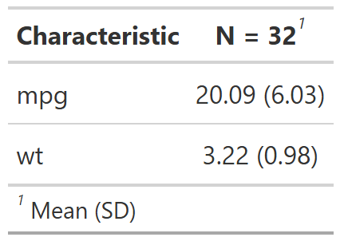

<!-- README.md is generated from README.Rmd. Please edit that file -->

```{r setup, include = FALSE}
knitr::opts_chunk$set(
  collapse = TRUE,
  warning = FALSE,
  message = FALSE,
  comment = "#>",
  fig.path = "man/figures/README-",
  out.width = "100%"
)
```

# mytablepkg

<!-- badges: start -->
[](https://github.com/melindahiggins2000/mytablepkg/actions/workflows/R-CMD-check.yaml)
[](https://app.codecov.io/gh/melindahiggins2000/mytablepkg)
<!-- badges: end -->


The goal of `mytablepkg` is to make tables easier from the `gtsummary::tbl_summary()` function. Add more here xx.


## Installation

You can install the development version of mytablepkg from [GitHub](https://github.com/) with:


``` r
# install.packages("pak")
pak::pak("melindahiggins2000/mytablepkg")
```

## Example with `mtcars`

This is a basic example which shows you how to get a table for normally distributed continuous variables showing the mean and standard deviation.

```{r example01a, echo = TRUE, eval = FALSE}
library(mytablepkg)
mytablepkg::cont_table(c("mpg", "wt"), mtcars)
```


```{r example01b, echo = FALSE, eval = TRUE}
library(mytablepkg)
mytablepkg::cont_table(c("mpg", "wt"), mtcars) |>
  gtsummary::as_gt() |>
  gt::gtsave(file = "man/figures/README-example01b.png")
```

```{r out.width = "50%", echo = FALSE, eval = TRUE}

```


